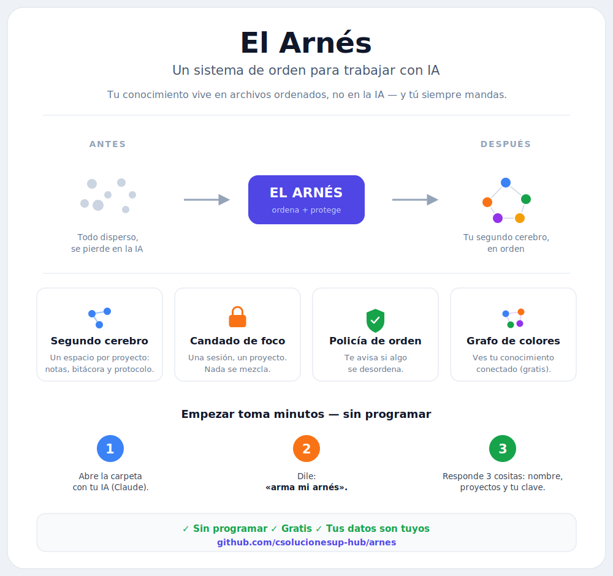

<p align="center">
  
</p>

# skill-arnes — generador del arnés replicable

Convierte el arnés (el sistema de orden de este vault) en algo que **se le puede dar a otra persona**
para que arme el mismo orden con SUS proyectos. Premisa karpathy: el vault es el cerebro, el modelo
solo mantiene → cualquiera puede replicarlo.

## Para quien lo regala

Copia **toda la carpeta `skill-arnes/`** y pásala (zip, USB, repo…). Quien la recibe solo abre
`EMPIEZA-AQUI.md` y sigue 3 pasos; su IA (o el asistente) hace el resto — no necesita programar.
Requisitos del que recibe: **Node.js** (gratis) o **Claude**; y opcional **Obsidian** (gratis) para el grafo.

## Estructura

```
skill-arnes/
  EMPIEZA-AQUI.md              # <- lo PRIMERO que abre quien lo recibe
  SKILL.md                     # cómo lo arma un modelo (Claude) conversando
  README.md                    # esto (detalle técnico)
  generar-arnes.js             # el generador: config -> vault-arnés COMPLETO
  asistente-setup.js           # asistente interactivo SIN IA (preguntas -> genera)
  sincronizar-motor.js         # re-copia el motor vivo a motor/ (evita drift)
  setup-config.example.json    # config de ejemplo (copiar y llenar)
  plantillas/                  # se rellenan con los datos del dueño
    AGENTS.md.tpl              #   constitución genérica (ley única)
    registro.md.tpl · harness-check.ps1.tpl · gitignore.tpl
    abrir-sesion.ps1.tpl · cerrar-sesion.ps1.tpl   # helpers de sesión (foco + Nivel 3)
    grafo-hermoso.css.tpl · EMPIEZA-AQUI-vault.md.tpl
    cerebro/                   #   un juego por proyecto
      index.md.tpl · log.md.tpl · protocolo-codear.md.tpl · AGENTS.md.tpl (guardián)
  motor/                       # el motor PROBADO, copiado tal cual (se localiza al generar)
    validate.js · auditar.js · link-index.js
```

## Uso rápido

```bash
# 1. copia el ejemplo y ponle tus datos
cp setup-config.example.json mi-config.json
#    edita: owner, key, metaFolder, projects[]

# 2. genera el vault
node generar-arnes.js mi-config.json /ruta/a/mi-vault

# 3. valida
cd /ruta/a/mi-vault
git init
./harness-check.ps1        # -> "ARNÉS OK"
```

## Qué genera (vault turnkey, completo)

- `AGENTS.md` (constitución) + punteros `CLAUDE/CODEX/GEMINI.md`.
- `<META>/_sistema/harness/`: `manifest.json`, `audit-config.json`, `validate.js`, `auditar.js`,
  `link-index.js`.
- `harness-check.ps1` + **helpers de sesión** `abrir-sesion.ps1` / `cerrar-sesion.ps1` (foco + Nivel 3).
- **Grafo bonito de Obsidian (gratis):** `.obsidian/` con paleta por proyecto, modo oscuro y CSS.
- `.gitignore` + **`EMPIEZA-AQUI.md`** (orientación para quien lo recibe).
- El registro maestro.
- Un cerebro por proyecto: `index.md` + `log.md` + `protocolo-codear-<id>.md` + `AGENTS.md` (guardián).

## Config (campos)

| campo | qué es |
|---|---|
| `owner` | nombre del dueño (el que decide) |
| `ownerOrg` | su organización (opcional) |
| `key` | clave del candado de foco (secreta; la elige el dueño) |
| `metaFolder` | carpeta del sistema (default `_SISTEMA`) — aloja `_sistema/harness/` |
| `registry` | ruta del registro maestro |
| `projects[]` | `{ id, name, cerebro, aliases?, codeType?, codePath? }` por proyecto |

## Extras que dependen de algo externo (NO vienen; se cablean si el dueño quiere)

- **graphify semántico** (auto-enlace de notas por IA) — dependencia paga. El grafo **nativo** de
  Obsidian ya funciona sin esto (con los `[[enlaces]]` de `link-index.js`).
- **Ronda diaria** del policía (tarea programada del SO).

Todo lo demás (constitución + contrato + motor + cerebros + validador + helpers de sesión + grafo
visual + orientación) **ya viene instalado y probado**.

## Nota de mantenimiento

`motor/*.js` son copias del motor de este vault (`_MASTER-CS/_sistema/harness/`). Si el motor
evoluciona (nuevos candados), corre `node sincronizar-motor.js` para re-copiarlas. El generador las
localiza al nuevo dueño (reemplaza el nombre del autor en los mensajes del policía); no toca la lógica.
